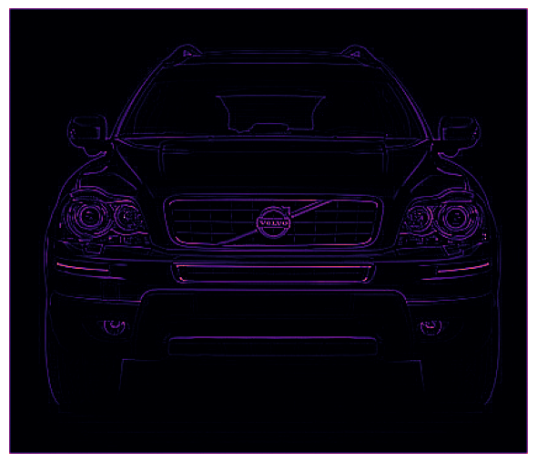
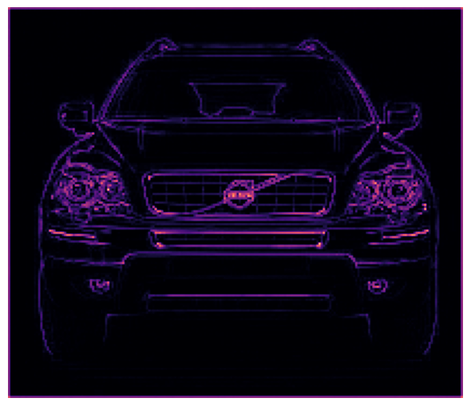

# General Terminology

- Stochastic? -> random
- training information -> signal or noise
  - Signal -> valuable information that helps the model making the future predictions on real-life data
  - Noise -> Non-informative patterns that only visible in training and not real-life data
- Drawing a bunch of data that a quadratic function would fit, **underfitting** -> linear, **overfitting** -> cubic or other higher order polynomials

- Tokenizer works better in English than other languages, mainly because the training data of language modeling and also for tokenization process is scarce.

## Convolutional Neural Network

- Convolution image classifiers usually have two important layers: **convolutional layer** with **ReLU activation**, and the **maximum pooling** **layer**
- The feature extraction performed by the base consists of three basic operations:

1. Filter an image for a particular feature (convolution)
2. Detect that feature within the filtered image (ReLU)
3. Condense the image to enhance the features (maximum pooling)

- Think of a polarized lens, focusing on particular pixels
- The weights are the number within the kernels themselves, which are randomly initialized
- Visual features after applying the filter and go through a non-linear function like ReLU are called **feature map**
- Going through a non-linear function to capture important pixels and negate unimportant ones

- Original image 
- After apply a filter 
- After go through a non-linear 

- After applying ReLU, the feature maps may contain lots of 0s -> we need to find a way to downsample(aka make the map smaller and more condense -> more effective gradient) -> maximum(average) pooling
- After apply maximum pooling 
- Does the zero pixels really contain no information? Wrong, they contain **positional** information -> when we remove those pixels, an interesting property emerges -> **translation invariance**
- Translation? In mathmetical terms, it tell us to change the position of something without rotate or change it's shape or sizes 
- Why is it important? Since the same kind of features can emerge at different positions in an image, we want the classifier to notice that they are the same or closely resembled
- In simple terms, we care less about where the feature activates(x, y) on the image and just focus on whether the feature is activated or not.